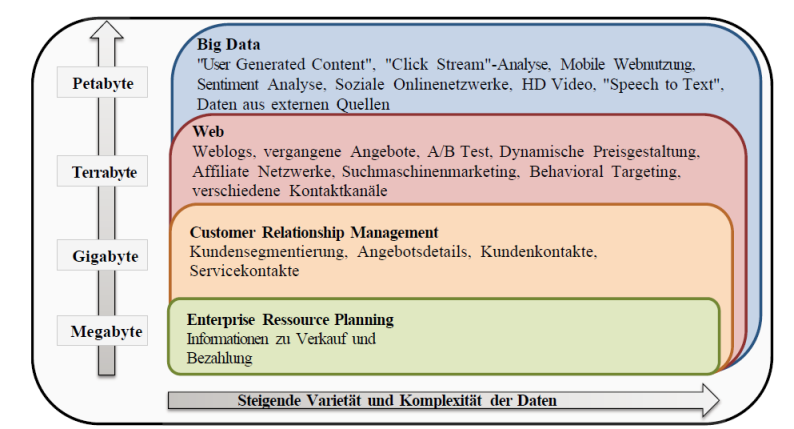

Big Data: Grundlagen
---------------------

Quelle: Big Data, Potential und Barrieren der Nutzung im Unternehmenskontext

---

Daten, die die Prozesskapazität von konventionellen Datenbanksystemen aufgrund der Menge, Schnelllebigkeit oder
inkompatiblen Struktur überschreiten. 

Daten die weit herogener als klassische Daten sind, u.a. durch hinzuziehen auch externer Daten für analytische Aufgaben.
 
Wenn mit Daten das geschlossene Datenuniversum einer Firma aufgesprengt wird um eine globalere Sicht auf das Unternehmen zu erhalten.

### Charakteristika

-  **Umfang („Volume“)**: eine grosse Menge an Daten, die aufgenommen, analysiert und gemanagt werden muss. Der Datenumfang steigt mit der
Anzahl der Quellen und der höheren Auflösung bzw. Datentiefe.

- **Varietät („Variety“)**: Daten stammen zunehmend aus neuen Quellen innerhalb und ausserhalb der Organisation, ihre Struktur variiert stark, es können auch bisher unbekannte Strukturierungsformen (z.B. [Open311](https://de.wikipedia.org/wiki/Open311), [KMZ](https://de.wikipedia.org/wiki/Keyhole_Markup_Language)) auftreten.

- **Schnelllebigkeit („Velocity“)**: die Geschwindigkeit, mit der Daten produziert und verändert werden müssen. Dies verlangt eine rasche Analyse und Entscheidungsfindung. Die Schnelllebigkeit wird von der Anzahl der Quellen und der gesteigerten Rechenleistung der datengenerierenden
Geräte beeinflusst.

- **Richtigkeit („Veracity“)**: die Qualität und Quelle der rezipierten Daten. Erstere wird unter anderem von Inkonsistenz, Unvollständigkeit und  Mehrdeutigkeit beeinflusst. Das Fällen von datenbasierten Entscheidungen verlangt Nachvollziehbarkeit und Begründbarkeit.

### Beispiele

* [Relationale Datenbanken](mysql/README.md)
* [Key/Value Stores](redis/README.md)
* [Document Stores](mongodb/README.md)
* [Graphen Datenbanken](neo4j/README.md)
* [Column Family Stores](cassandra/README.md)

