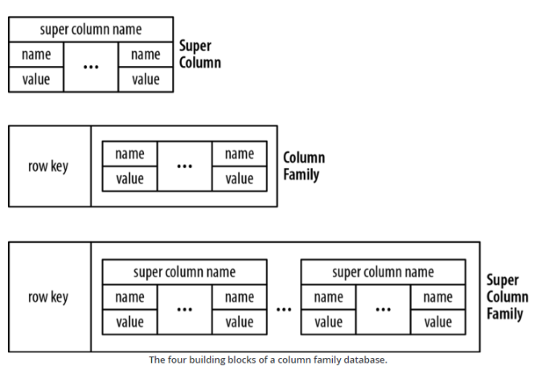

Column Family Stores
--------------------

Quelle: <a href="https://neo4j.com/blog/aggregate-stores-tour/">Neo4j Blog</a>

---

Column Families, oder auch Wide Column Stores genannt, ähneln in der NoSQL Welt am meisten einer Relationalen Datenbank. 

Speichern Datensätze in multidimensionalen Maps ab, die relationalen Objekten ähnlich sind. 

Werte in dieser multidimensionalen Map bestehen aus einem Schlüssel-Wert Paar. Der Schlüssel wiederum besteht aus einem Triplet aus Reihenschlüssel, Kolonnenschlüssel und Zeitstempel.

Der Reihenschlüssel ist der eindeutige Schlüssel eines Datensatzes und darf in einer Tabelle nur einmal vorkommen. Dieser bestimmt auch die Sortierung in der Tabelle und das Autosharding (Methode um Daten über mehrere Maschinen zu verteilen). 

Kolonnen werden in sogenannten Column Families zusammengefasst. Jede Column Family hat 1 oder mehrere Kolonnen. 

Ein Kolonnenschlüssel besteht daher aus dem Identifikator der Column Family und dem Identifikator der
Kolonne. 

**Werden neue Werte in die Kolonne geschrieben, überschreiben diese die alten Werte nicht, sondern werden mit einem neuen Zeitstempel hineingeschrieben. Dadurch entsteht eine automatische Versionierung der Werte in einer Kolonne.**

Datensätze in einer Tabelle haben alle die gleichen Column Families, diese können aber unterschiedlich viele Kolonnen haben. Column Families werden benutzt, um die Daten physisch abzuspeichern, zu komprimieren und zu verteilen.

Einige Column Family Datenbanken kennen Super Columns und Super Column Families. Super Colums sind ähnliche Konstrukte wie Views in Datenbanken. Sie beschreiben eine Sicht auf mehrere Kolonnen, ähnlich wie Column Families, ohne aber die Kolonnen physisch zu kreieren. Super Column Families implementieren den gleichen Mechanismus, wie Super Columns, nur auf Column Families aufgesetzt.

**Die Modellierung der Daten erfolgt anhand der gewünschten Abfragen (Queries)**

### Anwendungen

- Hoch verteilte Big Data Anwendungen

### Links

- [Cassandra](http://cassandra.apache.org/)
- [The Cassandra Query Language (CQL)](http://cassandra.apache.org/doc/latest/cql/index.html)
- [Cassandra bei Example (Twissandra)](http://de.slideshare.net/jericevans/cassandra-by-example-data-modelling-with-cql3)
- [Cassandra the Definitive Guide (Hotel)](https://www.safaribooksonline.com/library/view/cassandra-the-definitive/9781449399764/ch04.html)
- [CQL data modeling (Music Service)](http://docs.datastax.com/en/cql/3.1/cql/ddl/ddlCQLDataModelingTOC.html)
- [Datenmodellierung mit Cassandra (Kurs)](https://academy.datastax.com/resources/ds220-data-modeling)
- [Cassandra Tutorial](https://www.tutorialspoint.com/cassandra/index.htm)
- [Cassandra Docker Image](https://github.com/docker-library/docs/tree/master/cassandra)
- [HBase](https://hbase.apache.org/)

### Datenmodellierung

- ER-Diagramme erstellen, um die fachlichen Entitäten, Attribute und deren Beziehungen zueinander zu verstehen (konzeptionelles Datenmodell)

- Alle Abfragen identifizieren, die von der Applikation gegen die Datenbank abgesetzt werden

- Ausgehend von dem ER-Diagramm: ein Datenmodell entwickeln, das die Zugriffspfade der jeweiligen Queries optimiert (logisches Datenmodell)

- Umwandlung in konkrete CQL-Tabellenstrukturen (physisches Datenmodell) unter Berücksichtigung von Überlegungen zu Partitionsgröße, Datenduplizierung, Konsistenz oder Auswirkungen paralleler Benutzer­zugriffe

### Beispiele

Beispiel basierend auf - [CQL data modeling (Music Service)](http://docs.datastax.com/en/cql/3.1/cql/ddl/ddlCQLDataModelingTOC.html)

**Cassandra Container starten:** Beenden mittels Eingabe von 2mal `exit`.

    kubectl apply -f duk/bigdata/cassandra.yaml
    runbash cassandra
    cqlsh
	
**Datenstrukturen erstellen:**

Zuerst KeySpace (Namensbereich) - ohne Replizierung - und Umschalten auf diesen:

	CREATE KEYSPACE music WITH REPLICATION = { 'class' : 'SimpleStrategy', 'replication_factor' : 1 };
	USE music;

**Tabellen erstellen:**

	CREATE TABLE songs (
	  id uuid PRIMARY KEY,
	  title text,
	  album text,
	  artist text,
	  data blob
	 );
	
	CREATE TABLE playlists (
	  id uuid,
	  song_order int,
	  song_id uuid,
	  title text,
	  album text,
	  artist text,
	  PRIMARY KEY  (id, song_order ) );
	  
**Daten einfügen:**

	INSERT INTO playlists (id, song_order, song_id, title, artist, album)
	  VALUES (62c36092-82a1-3a00-93d1-46196ee77204, 1,
	  a3e64f8f-bd44-4f28-b8d9-6938726e34d4, 'La Grange', 'ZZ Top', 'Tres Hombres');
	
	INSERT INTO playlists (id, song_order, song_id, title, artist, album)
	  VALUES (62c36092-82a1-3a00-93d1-46196ee77204, 2,
	  8a172618-b121-4136-bb10-f665cfc469eb, 'Moving in Stereo', 'Fu Manchu', 'We Must Obey');
	
	INSERT INTO playlists (id, song_order, song_id, title, artist, album)
	  VALUES (62c36092-82a1-3a00-93d1-46196ee77204, 3,
	  2b09185b-fb5a-4734-9b56-49077de9edbf, 'Outside Woman Blues', 'Back Door Slam', 'Roll Away');
	  
	INSERT INTO playlists (id, song_order, song_id, title, artist, album)
	  VALUES (62c36092-82a1-3a00-93d1-46196ee77204, 4,
	  7db1a490-5878-11e2-bcfd-0800200c9a66,
	  'Ojo Rojo', 'Fu Manchu', 'No One Rides for Free');	  
	  
**Daten abfragen:**

	SELECT * FROM playlists;
	
SQL - welcher von Cassandra zurückgewiesen wird, weil die Abfrage einen Sequenziellen Scan erfordert

	SELECT album, title FROM playlists WHERE artist = 'Fu Manchu';
	
Lösung: Index auf Artist erstellen

	CREATE INDEX ON playlists( artist );
	SELECT album, title FROM playlists WHERE artist = 'Fu Manchu';
	
