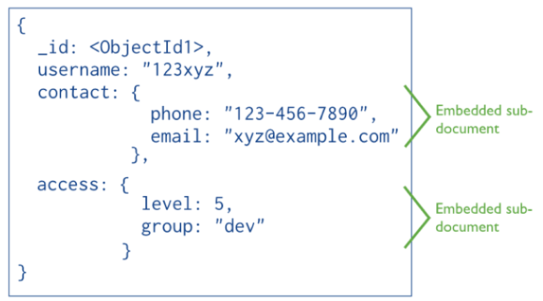

Document Stores
---------------

Quelle: <a href="https://neo4j.com/blog/aggregate-stores-tour/">Neo4j Blog</a>

---

Document Stores sind eine Erweiterung der Key/Value Stores. 

Weisen eine Schlüssel Werte-Paar Speicherstruktur auf, ihre Werte sind aber komplexe Datenstrukturen, die als Dokumente bezeichnet werden. 

Der Schlüssel ist ein eindeutiger Wert über die ganze Datenbank hinweg. 

Dokumente sind unabhängig voneinander. Das heißt, dass die Struktur der jeweiligen Dokumente sich massiv unterscheiden können.

Möglichkeit Dokumente basierend auf ihren Attributen zu indexieren. Um Sichten auf ähnliche Dokumente, so genannte Kollektionen von Dokumente,
zu erstellen.

Dokumente können anhand der Attribute gefiltert werden und Relationen zwischen Dokumenten mit Verweise auf die Schlüsselwerte in einem
Dokument erstellt werden. 

### Anwendungen

- Realtime Analytics
- Content Manangement Systems (CMS)
- Caching
- Single Document, partial updates
- Speichern von Dokumenten in JSON

### Links

- [MongoDB Tutorial](https://docs.mongodb.com/manual/crud/)
- [MongoDB](https://www.mongodb.com/)
- [CouchDB](http://couchdb.apache.org/)

### Beispiele

**MongoDB Container starten:** Beenden mittels Eingabe von 2mal `exit`.

    kubectl apply -f duk/bigdata/mongodb/mongodb.yaml
    runbash mongodb
    mongo -psecret -utest

**Daten** im JSON Format **einfügen:**

	db.adressbuch.insert( 
	{
		vorname: "Daniel",
		nachname: "Fasel",
		email: "df@scigility.com",
		adresse: 
		{
			strasse: "Rte du soleil 22",
			ort: "Fribourg",
			plz: 1700,
			land: "Switzerland"
			},
		korrespondenzsprache: "französisch"
	} )

	db.adressbuch.insert(
	{
		vorname: "Andreas",
		nachname: "Meier",
		email: "andreas.meier@unifr.ch",
		adresse: 
		{
			strasse: "Bd de Pérolles 90",
			ort: "Fribourg",
			plz: 1700
		}
		} )
	
**Daten abfragen:**

Dokumente mit Ort = Fribourg

	db.adressbuch.find({"adresse.ort" : "Fribourg"})
	
Dokumente mit tag: korrespondenzsprache

	db.adressbuch.find( { korrespondenzsprache: { $exists: true }} )
	
Anzahl Dokumente mit Plz 1700 (Fribourg)
	
	db.adressbuch.find( { "adresse.plz": 1700 } ).count()

Reguläre Ausdrücke

	db.adressbuch.find( { "adresse.ort": /^Fr/i } )
	db.adressbuch.find( { "adresse.ort": /bourg/i } )

**Daten Importieren in laufenden Container:**

Zweite Testumgebung (Linux Bash) starten, in MongoDB Container wechseln und `wget` installieren

    runbash mongodb
    apt-get update
    apt-get install -y wget

Daten downloaden und importieren

	cd /tmp
	wget https://raw.githubusercontent.com/mongodb/docs-assets/primer-dataset/primer-dataset.json
	mongoimport -utest -psecret --collection restaurants --drop --file primer-dataset.json
	
Zurück auf MongoDB Container wechseln und Restaurants abfragen:

	use test
	db.restaurants.find()
	
Details siehe: [Import Example Dataset](https://docs.mongodb.com/getting-started/shell/import-data/)
