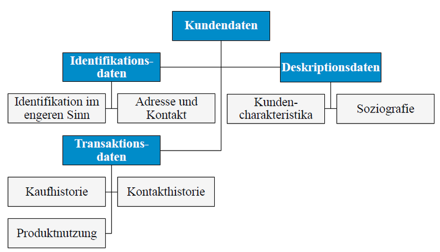

Relationale Systeme
-------------------

Quelle: Big Data, Potential und Barrieren der Nutzung im Unternehmenskontext

---

Relationale Systeme verarbeiten strukturierte und formatierte Daten in Form von Tabellen. 

Die Struktur der Daten inkl. der verwendeten Datentypen muss dem Datenbanksystem durch die Spezifikation eines Schemas mitgeteilt werden (vgl. CREATE TABLE Befehl von SQL). 

Bei jedem SQL-Aufruf werden die Systemtabellen konsultiert, um u. a. Autorisierungs- und Datenschutzbestimmungen zu prüfen

Oft Werten die Daten weiter in 
- Identifikationsdaten, 
- Deskriptionsdaten (Beschreibende)  
- Transaktionsdaten

unterteilt

Weniger geeignet sind Relationale Systeme u.a. für die Speicherung von

- Parameter (Key / Value)
- Unstrukturierte Daten
- [Semantik](https://de.wikipedia.org/wiki/Semantik) (Bedeutungslehre)

### Anwendungen

- Elektronischen Datenverwaltung in Computersystemen
- Fachapplikationen 

### Links

- [MySQL](https://www.mysql.de/)
- [PostgreSQL](https://www.postgresql.org/)
- [Einfaches SQL Beispiel](http://www.php-kurs.com/relationen-tabellen-verbinden.htm)
- [MySQL Einführung](http://www.peterkropff.de/site/mysql/grundlagen.htm)

### Beispiele

**MySQL Container starten:** Beenden mittels Eingabe von 2mal `exit`.

    kubectl apply -f duk/mysql/mysql.yaml
	runbash mysql
	mysql -psecret -utest test

**Tabellen erstellen:**

	CREATE TABLE adressen ( 
		id INT NOT NULL AUTO_INCREMENT PRIMARY KEY, 
		geschlecht CHAR( 1 ),
		nachname VARCHAR( 255 ) NOT NULL ,
		vorname VARCHAR( 255 ) NOT NULL ,
		strasse VARCHAR( 200 ),
		plz INT( 5 ) NOT NULL ,
		tel VARCHAR( 100 ),
		email VARCHAR( 150 ),
		url VARCHAR( 150 ) 
	);
	
	CREATE TABLE orte (
		plz INT( 5 ) NOT NULL,
		ort VARCHAR( 255 ) NOT NULL,
		PRIMARY KEY ( plz )
	);
	
**Daten einfügen:**

	INSERT INTO orte( plz, ort ) VALUES( 8000, "Zuerich" );
	INSERT INTO orte( plz, ort ) VALUES( 4000, "Basel" );
    INSERT INTO adressen( nachname, vorname, plz ) VALUES ( "Ott", "Elfriede", 4000 );
	INSERT INTO adressen( nachname, vorname, plz ) VALUES ( "Muster", "Hans", 8000 );
		
**Daten abfragen:**

	SELECT * FROM adressen;
	SELECT * FROM adressen LEFT JOIN orte ON adressen.plz = orte.plz;
	
