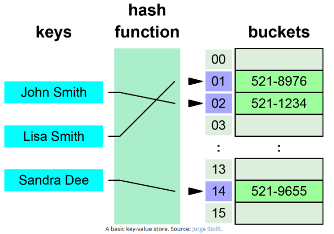

Key / Value Stores
------------------

Quelle: <a href="https://neo4j.com/blog/aggregate-stores-tour/">Neo4j Blog</a>

---

- Einfachster Vertreter von NoSQL Datenbanken.
- Einfache Struktur aus Schlüssel und Wert Paaren.
- Weder Schlüssel noch Werte aus komplexen Datentypen.
- Der Schlüssel ist eineindeutig.
- Es werden keine Indexe aufgebaut. 
- Datensätze können sehr schnell geschrieben und gelesen werden.
- Nicht geeignet für Komplexere Operationen wie das Vergleichen von verschiedenen Datensätzen oder die Produktbildung von mehreren
Datensätzen.
- Werden oft In-Memory gehalten und verarbeitet.

### Anwendungen

- Volatiler Zwischenspeicher von Webapplikationen (z.B. Speichern von aufbereiteten HTML Seiten).
- Unterstützung des Publish / Subscribe Pattern für das Empfangen und Abfragen von IoT Werten
- Persistente Speicherung von Datensätzen mit sehr einfacher Datenstruktur, welche als Schlüssel Wert-Paar dargestellt werden können

### Links

- [Redis Tutorial](http://try.redis.io/)
- [Redis](https://redis.io/)
- [Dockerfile für Redis](https://github.com/docker-library/redis)
- [Redis Installation](https://wiki.ubuntuusers.de/Redis/)
- [Memcached](https://memcached.org/)

### Beispiele

**Redis Container starten:**. Beenden mittels Eingabe von 2mal `exit`.

    kubectl apply -f duk/bigdata/redis.yaml
    runbash redis
    redis-cli

**Key/Value:** z.B. Speichern eines Servernamens und anschliessendes Lesen und Löschen:

	 SET server:name "myhost"
	 GET server:name 
	 DEL server:name
 
**Verwalten von Countern:** Dabei ist sichergestellt, dass ein Wert nur einmal zurückgegeben wird, auch bei mehreren Clients.

	 SET connections 10
	 INCR connections 
	 GET connections

**Zeitabhängige Werte:** d.h. ein Wert ist nur die Zeit in Sekunden gültig.

	SET resource:lock "Redis Demo"
	EXPIRE resource:lock 120
	TTL resource:lock
	GET resource:lock 

**Listenwerte:** `RPUSH` um neue Werte am Ende, `LPUSH` um Werte am Anfang, `LRANGE` um Werte von/bis auszugeben,
`LLEN` für die Anzahl Werte und `RPOP` um letzten Wert zurückzugeben und diesen von der Liste zu löschen.

	RPUSH hosts a1
	RPUSH hosts m1
	RPUSH hosts b1
	LLEN hosts
	LRANGE hosts 1 2
	RPOP hosts
	
**Sets (Unsortierte Listen):** `SADD` um Werte einzutragen, `SREM` um zu löschen und `SISMEMBER` um Abzufragen ob ein Eintrag existiert.

	SADD superpowers "flight"
	SADD superpowers "x-ray vision"
	SADD superpowers "reflexes"
	
	SREM superpowers "reflexes"
		
	SISMEMBER superpowers "flight"
	SISMEMBER superpowers "reflexes" 

**Hash Maps (Key(Key/Value)):** `HSET` und `HMSET` um Werte zu setzen und `HGETALL` und `HGET` um Werte zu lesen. 

	HSET user:1000 name "John Smith"
	HSET user:1000 email "john.smith@example.com"
	HSET user:1000 password "s3cret"
	
	HGETALL user:1000
	
	HMSET user:1001 name "Mary Jones" password "hidden" email "mjones@example.com"
	
	HGET user:1001 name

**Counter in Hash Maps:**

    HSET user:1000 visits 10
    HINCRBY user:1000 visits 1 
    HINCRBY user:1000 visits 10 
    HDEL user:1000 visits
    HINCRBY user:1000 visits 		
	 
