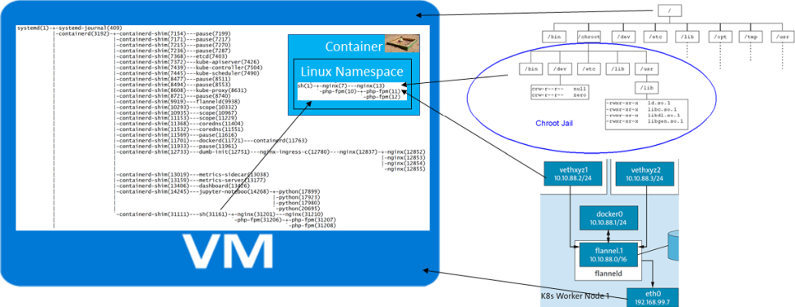

Linux Namespaces
================

- - -

Die Aufgabe von Linux Namespaces ist es die Ressourcen des Kernsystems (in diesem Falle also des Kernels) voneinander zu isolieren.

### Arten von Namespaces

* IPC -Interprozess-Kommunikation
* NET - Netzwerkressourcen
* PID -Prozess-IDs
* USER - Benutzer/Gruppen-Ids
* (UTS - Systemidentifikation): Über diesen Namespace kann jeder Container einen eigenen Host- und Domänennamen erhalten.

## Beispiele

Die folgenden Befehle sind in einer (Ubuntu) Linux Umgebung ausführen.

### Wechsel in eigener Namespace mit eigenem Netzwerk und Prozess-IDs

    sudo unshare -n  -p --fork  --mount-proc sh
    
Testen ob Prozesse und Netzwerk isoliert sind:

    pstree -p               # zeigt nur Prozess in meinem Namespace
    ping google.com         # kann nicht aufgelöst werden, weil Netzwerk fehlt
    ip addr                 # nur loopback Netzwerkadapter vorhanden
    exit

Verwendung von docker statt sudo unshare und Ausführen der drei obigen Befehle:

    docker run -it alpine sh
    pstree -p               # zeigt nur Prozess in diesem Container
    ping google.com         # kann  aufgelöst werden, weil Docker ein Netzwerk Adapter installiert
    ip addr                 # loopback und Docker Netzwerk Adapter vorhanden
    exit

        
### unshare -Alpine Linux in Linux Namespace betreiben

Folgendes Beispiel holt das Container Image von Alpine Linux entpackt diese im Verzeichnis `myalpine` und wechselt mittels `unshare` 
den Linux Namespaces und setzt den Root `/` auf `myalpine`.

    mkdir myalpine
    docker export $(docker create alpine) | sudo tar -C myalpine -xvf -
    sudo cp /etc/resolv.conf myalpine/etc/
    sudo unshare -p --fork --mount-proc -R myalpine sh
    cat /etc/issue
    pstree -p -n                # schlägt fehl, kein ubuntu Linux
    pstree -p
    # weitere Software installieren
    apk update
    apk add vim
    exit
    
### Docker - Wechsel in Container mittels `nsenter` von Linux

    docker run --name birdpedia --rm -d misegr/birdpedia:1.0-alpine
    sudo nsenter -t $(docker inspect --format '{{ .State.Pid }}' birdpedia) -a sh
    pstree -p  # Sicht innerhalb  des Containers (Namespace)
    ls -l
    cat /etc/issue
    exit
    
Prozess-Id ausserhalb des Containers anzeigen
    
    docker inspect --format '{{ .State.Pid }}' birdpedia
    pstree -n -p -T -A
    
**Mit Kubernetes und GitLab als Container Registry**

    kubectl run birdpedia --image=registry.gitlab.com/mc-b/birdpedia/birdpedia:1.0-alpine --restart=Never
    sudo nsenter -t $(pstree -n -p -T -A | grep birdpedia | cut -f 3 -d'(' | tr -d ')') -a sh
    pstree -p  # Sicht innerhalb  des Containers (Namespace)
    ls -l
    cat /etc/issue
    exit    
    
### Docker - Wo legt der Container seine Dateien ab?

    sudo -i
    cd $(docker inspect --format '{{ .GraphDriver.Data.MergedDir }}' mycontainer)
    ls -l

### Docker - Netzwerk Adapter im Container

Im Container wird ein Netzwerk Adapter angelegt, welcher, wie eine Pipe, mit dem Container Host Netzwerk verbunden ist.

    sudo -i
    sudo nsenter -t $(docker inspect --format '{{ .State.Pid }}' mycontainer) -a ip addr
    
    # Netzwerk Adapter ausserhalb des Containers
    ip addr

Die Nummer hinter `eth0@if` zeigt auf den Netzwerk Adapter im Container Host.

    
    

    

