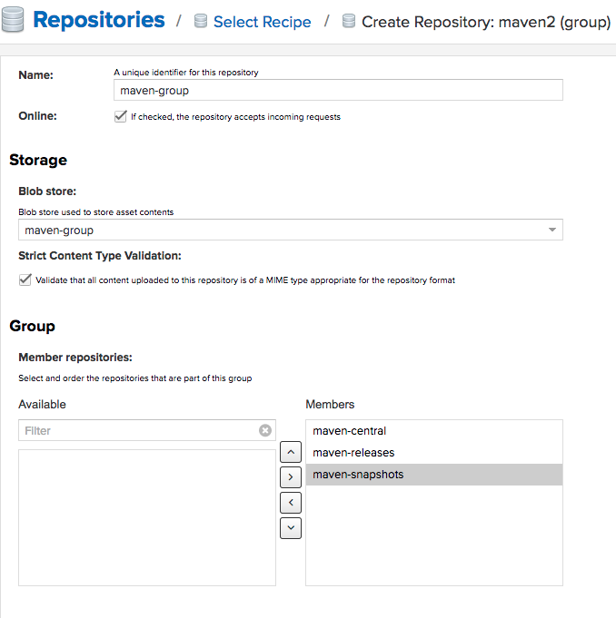

Registries / Repositories
=======================

Ein Repository (englisch für Lager, Depot oder auch Quelle; Plural: Repositorys), auch – direkt aus dem Lateinischen entlehnt – Repositorium (Pl. Repositorien), ist ein verwaltetes Verzeichnis zur Speicherung und Beschreibung von digitalen Objekten für ein digitales Archiv. Bei den verwalteten Objekten kann es sich beispielsweise um Programme (Software-Repository), Publikationen (Dokumentenserver), Datenmodelle (Metadaten-Repository) oder betriebswirtschaftliche Verfahren handeln. Häufig beinhaltet ein Repository auch Funktionen zur Versionsverwaltung der verwalteten Objekte.

Folgende Registries/Repositories stehen zur Verfügung:
* [Docker Registry](#docker-registry)
* [Maven Nexus 3 Registry](#nexus3-repository)

Docker Registry
---------------

Insecure Docker Registry basierend auf [vagrant-boxes](https://github.com/savishy/vagrant-boxes).

Diese Registry ist unsicher (d.h. keine TLS Verschlüsselung) und sollte nur zu Entwicklungs und Schulungszwecken verwendet werden.

**Starten:**

	kubectl apply -f duk/registry/registry2.yml
	kubectl apply -f duk/registry/registry2-frontend.yaml
	
**Image in lokaler Registry ablegen**

	docker pull hello-world
	docker tag ubuntu localhost:32500/hello-world
	docker push localhost:32500/hello-world

**User Interface:**

Das UserInterface ist via [http://localhost:32580](http://localhost:32580) erreichbar und sollte selbsterklärend sein.
	
### Docker Repositories

* [Docker Registry](https://hub.docker.com/_/registry/)
* [Docker Frontend von Konrad Kleine](https://hub.docker.com/r/konradkleine/docker-registry-frontend/) 

Nexus3 Repository
-----------------

<iframe allowtransparency="true" title="Wistia video player" allowFullscreen frameborder="0" scrolling="no" class="wistia_embed" name="wistia_embed" src="https://fast.wistia.net/embed/iframe/ql2mvo4kgz" width="400" height="225"></iframe>

Sonatype Nexus und Apache Maven sind zwei Softwareteile, die oft zusammenarbeiten, aber sehr unterschiedliche Aufgaben erfüllen. 

Nexus stellt ein Repository bereit, während Maven ein Repository zum Erstellen von Software verwendet. 

Nexus verwaltet Software "Artefakte", die für die Entwicklung benötigt werden.

### Starten

    kubectl apply -f duk/registry/nexus3.yml
    
Die Oberfläche ist mittels [http://localhost:32510](http://localhost:32510) mit Username `admin` und Password `admin123` erreichbar.    
    
### Konfiguration

Damit Maven auf das Repository zugreift muss die Datei `~/.m2/settings.xml` wie folgt erweitert bzw. geändert werden:

    <?xml version="1.0" encoding="UTF-8"?>
    <settings xmlns="http://maven.apache.org/SETTINGS/1.1.0"
      xmlns:xsi="http://www.w3.org/2001/XMLSchema-instance"
      xsi:schemaLocation="http://maven.apache.org/SETTINGS/1.1.0 http://maven.apache.org/xsd/settings-1.1.0.xsd">
    
      <servers>
        <server>
          <id>nexus-snapshots</id>
          <username>admin</username>
          <password>admin123</password>
        </server>
        <server>
          <id>nexus-releases</id>
          <username>admin</username>
          <password>admin123</password>
        </server>
      </servers>
    
      <mirrors>
        <mirror>
          <id>central</id>
          <name>central</name>
          <url>http://nexus3:8081/repository/maven-group/</url>
          <mirrorOf>*</mirrorOf>
        </mirror>
      </mirrors>
    
    </settings>  
    
Um Daten in das Repository ablegen zu können muss eine `maven-group` angelegt werden welches die Repositories `maven-central`, `maven-releases` und `maven-snapshots` beinhaltet.

Anschliessend sind im jedem Maven Projekt die folgenden Zeilen ins `pom.xml` einzutragen:

    <distributionManagement>
       <!--  mvn release:clean release:prepare release:perform erzeugt neuen Release auf github und Artefakt in Nexus Repository -->
        <repository>
            <id>nexus-releases</id>
            <url>http://nexus3:8081/repository/maven-releases/</url>
        </repository>
        <!--  mvn deploy erstellt Snapshot in Nexus Repository -->
        <snapshotRepository>
            <id>nexus-snapshots</id>
            <url>http://nexus3:8081/repository/maven-snapshots/</url>
        </snapshotRepository>
    </distributionManagement>
      
      
### Snapshot erstellen
      
Um das Projekt zu builden und im Maven Repository `maven-snapshots` abzulegen ist der nachfolgende Befehle auszuführen:

    mvn deploy
    
### Release erstellen

Beim Erstellen eines Release wird ein Artefakt statt mit der Endung `-SNAPSHOT` mit der Version, z.B. `-1.0` erzeugt.

Ausserdem wird ein neuer Release auf GitHub erstellt.

Zuerst ist `pom.xml` um den GitHub URL zu ergänzen, z.B.

    <scm>
        <developerConnection>scm:git:[url]</developerConnection>
        <tag>HEAD</tag>
    </scm>
    
Anschliessend kann mit folgenden Befehlen, zuerst ein Release auf GitHub und nachher ein Deployment auf maven-releases erstellt werden.

    mvn release:prepare
    mvn release:perform

**Alternative**: Entfernt `-SNAPSHOT` aus dem `pom.xml` und führt `mvn deploy` aus. 

### Links

* [Maven Release](https://maven.apache.org/guides/mini/guide-releasing.html)
* [Maven Release Plug-in](http://maven.apache.org/maven-release/maven-release-plugin/index.html)    