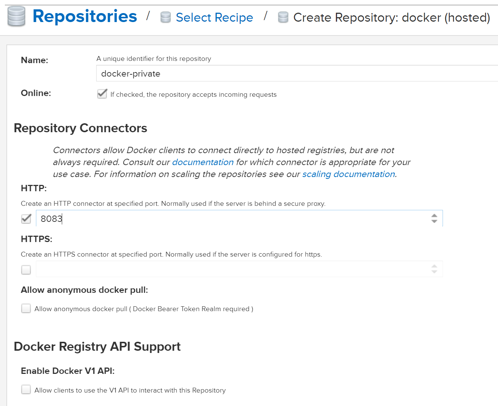
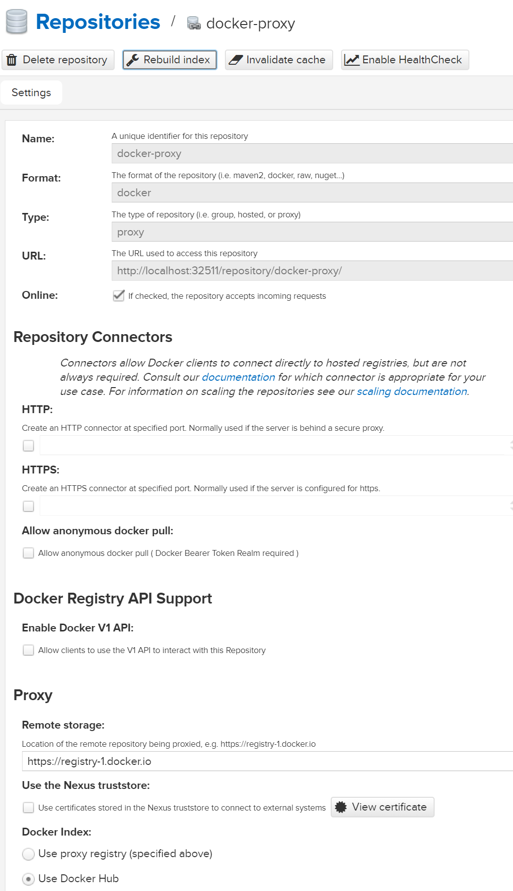
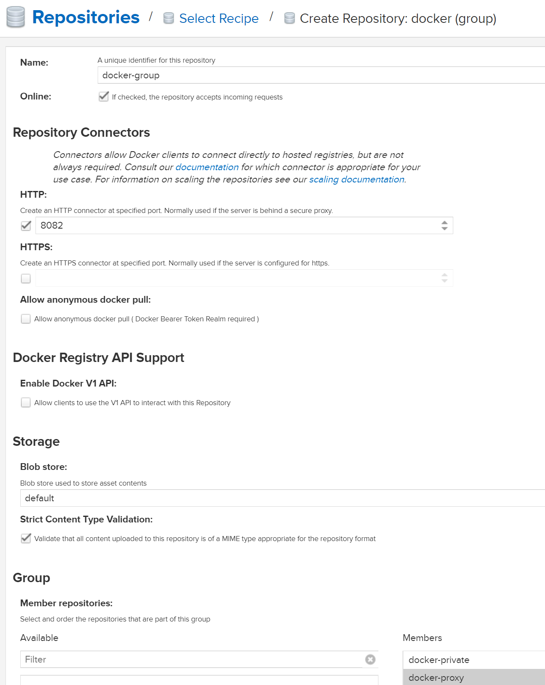
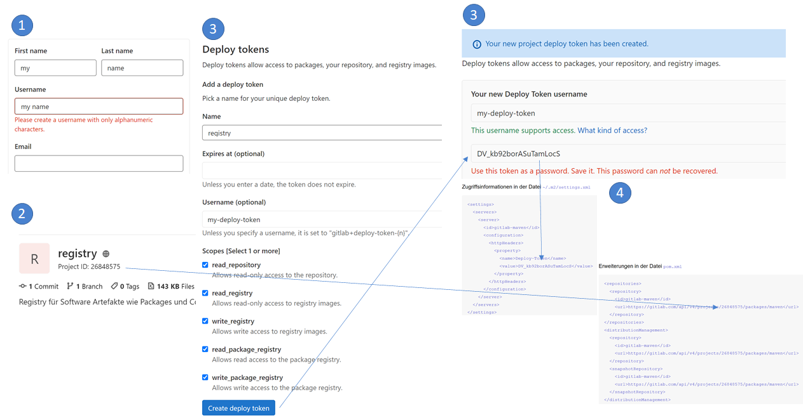
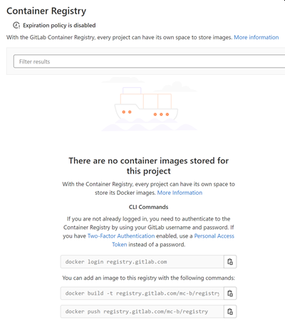

Registries / Repositories
=======================

Ein Repository (englisch für Lager, Depot oder auch Quelle; Plural: Repositorys), auch – direkt aus dem Lateinischen entlehnt – Repositorium (Pl. Repositorien), ist ein verwaltetes Verzeichnis zur Speicherung und Beschreibung von digitalen Objekten für ein digitales Archiv. Bei den verwalteten Objekten kann es sich beispielsweise um Programme (Software-Repository), Publikationen (Dokumentenserver), Datenmodelle (Metadaten-Repository) oder betriebswirtschaftliche Verfahren handeln. Häufig beinhaltet ein Repository auch Funktionen zur Versionsverwaltung der verwalteten Objekte.

Folgende Registries/Repositories stehen zur Verfügung:
* [Docker Registry](#docker-registry)
* [Maven Nexus 3 Registry](#nexus3-repository)
* [Maven Nexus 3 Docker Registry](#nexus3-docker-registry)
* [GitLab](#gitlab)

***
Docker Registry
---------------

Insecure Docker Registry basierend auf [vagrant-boxes](https://github.com/savishy/vagrant-boxes).

Diese Registry ist unsicher (d.h. keine TLS Verschlüsselung) und sollte nur zu Entwicklungs und Schulungszwecken verwendet werden.

**Starten:**

	kubectl apply -f duk/registry/registry2.yml
	kubectl apply -f duk/registry/registry2-frontend.yaml
	
**Image in lokaler Registry ablegen**

	docker pull hello-world
	docker tag ubuntu localhost:32500/hello-world
	docker push localhost:32500/hello-world

**User Interface:**

Das UserInterface ist via [http://localhost:32580](http://localhost:32580) erreichbar und sollte selbsterklärend sein.
	
### Docker Repositories

* [Docker Registry](https://hub.docker.com/_/registry/)
* [Docker Frontend von Konrad Kleine](https://hub.docker.com/r/konradkleine/docker-registry-frontend/) 

***
Nexus3 Repository
-----------------

Sonatype Nexus und Apache Maven sind zwei Softwareteile, die oft zusammenarbeiten, aber sehr unterschiedliche Aufgaben erfüllen. 

Nexus stellt ein Repository bereit, während Maven ein Repository zum Erstellen von Software verwendet. 

Nexus verwaltet Software "Artefakte", die für die Entwicklung benötigt werden.

### Starten

    kubectl apply -f duk/registry/nexus3.yml
    
Die Oberfläche ist mittels [http://localhost:32511](http://localhost:32511) mit Username `admin` und Password `admin123` erreichbar. 

**Tip**: sollte das Password in einer Datei im Container stehen, Dashboard anwählen und dort via Pod `nexus3` in Container wechseln.   
    
### Konfiguration

Damit Maven auf das Repository zugreift muss die Datei `~/.m2/settings.xml` wie folgt erweitert bzw. geändert werden:

    <?xml version="1.0" encoding="UTF-8"?>
    <settings xmlns="http://maven.apache.org/SETTINGS/1.1.0"
      xmlns:xsi="http://www.w3.org/2001/XMLSchema-instance"
      xsi:schemaLocation="http://maven.apache.org/SETTINGS/1.1.0 http://maven.apache.org/xsd/settings-1.1.0.xsd">
    
      <servers>
        <server>
          <id>nexus-snapshots</id>
          <username>admin</username>
          <password>admin123</password>
        </server>
        <server>
          <id>nexus-releases</id>
          <username>admin</username>
          <password>admin123</password>
        </server>
      </servers>
    
      <mirrors>
        <mirror>
          <id>central</id>
          <name>central</name>
          <url>http://nexus3:8081/repository/maven-group/</url>
          <mirrorOf>*</mirrorOf>
        </mirror>
      </mirrors>
    
    </settings>  
    
**Tip**: Datei im aktuellen Verzeichnis, z.B. mit Eclipse Theia, erstellen und nach ~/.m2/ verschieben.    
    
Anschliessend sind im jedem Maven Projekt die folgenden Zeilen ins `pom.xml` einzutragen:

    <distributionManagement>
       <!--  mvn release:clean release:prepare release:perform erzeugt neuen Release auf github und Artefakt in Nexus Repository -->
        <repository>
            <id>nexus-releases</id>
            <url>http://nexus3:8081/repository/maven-releases/</url>
        </repository>
        <!--  mvn deploy erstellt Snapshot in Nexus Repository -->
        <snapshotRepository>
            <id>nexus-snapshots</id>
            <url>http://nexus3:8081/repository/maven-snapshots/</url>
        </snapshotRepository>
    </distributionManagement>
      
      
### Snapshot erstellen
      
Um das Projekt zu builden und im Maven Repository `maven-snapshots` abzulegen ist der nachfolgende Befehle auszuführen:

    mvn deploy
    
### Release erstellen

Beim Erstellen eines Release wird ein Artefakt statt mit der Endung `-SNAPSHOT` mit der Version, z.B. `-1.0` erzeugt.

Ausserdem wird ein neuer Release auf GitHub erstellt.

Zuerst ist `pom.xml` um den GitHub URL zu ergänzen, z.B.

    <scm>
        <developerConnection>scm:git:[url]</developerConnection>
        <tag>HEAD</tag>
    </scm>
    
Anschliessend kann mit folgenden Befehlen, zuerst ein Release auf GitHub und nachher ein Deployment auf maven-releases erstellt werden.

    mvn release:prepare
    mvn release:perform

**Alternative**: Entfernt `-SNAPSHOT` aus dem `pom.xml` und führt `mvn deploy` aus. 

***
Nexus3 Docker Registry
----------------------

Die Nexus Registry kann auch als Docker Registry verwendet werden. Dazu ist die Registry, wie vorgängig beschrieben, zu starten und wie folgt zu konfigurieren:

Anlegen einer privaten Docker Registry

Anlegen einer Proxy Registry von Docker Hub:

Zusammenführen der beiden Registry mittels einer Docker Gruppe:

Damit auf die Registries zugegriffen werden kann, sind diese beim Start des Dockerdaemons anzugeben, z.B. in der Datei `/etc/systemd/system/docker.service`

    ExecStart=/usr/bin/dockerd --tlsverify --tlscacert=/etc/docker/ca.pem --tlscert=/etc/docker/server.pem \
    --tlskey=/etc/docker/server-key.pem -H=0.0.0.0:2376 -H fd:// \
    --insecure-registry=localhost:32512 --insecure-registry=localhost:32513
    
Beim Projekt [lernkube](https://github.com/mc-b/lernkube) geschieht dies automatisch.

Nach erfolgter Konfiguration stehen zwei Registries zur Verfügung:
* **docker-private** eine Private Docker Registry auf localhost:32513 um Images zu holen (pull) und zu schreiben (push).
* **docker-group** auf localhost:32512. Da diese auch **docker-proxy** beinhaltet können lokale und Images von Docker Hub geholt werden. Schreiben ist nicht möglich.

Je nach der Konfiguration muss man sich vorher an den Registries anmelden:

    docker login -u admin -p admin123 localhost:32512
    docker login -u admin -p admin123 localhost:32513
         
Um neue Images in die Private Docker Registry abzulegen sind diese zu taggen und zu pushen:

    docker tag hello-world localhost:32513/hello-world
    docker push localhost:32513/hello-world
    
Images können über die Docker Group geholt werden und zwar Private wie auch von Docker Hub. Die Auflösung nach Docker Hub erfolgt dabei automatisch.

    docker run localhost:32512/hello-world 
    
***    
GitLab
------  

GitLab kann Software "Artefakte" Verwaltung und als Container Image Registry verwendet werden.

### GitLab als Package Registry

- - -

1. Erstellt einen [GitLab Account](https://gitlab.com/users/sign_up)
2. Erstellt ein neues [Projekt](https://docs.gitlab.com/ee/user/project/working_with_projects.html) (Repository) mit Namen `registry`. Die Projektart spielt keine Rolle.
3. Erstellt, für das Projekt, einen [Deploy-Token](https://docs.gitlab.com/ee/user/project/deploy_tokens/) mit allen Rechten.
4. Überträgt Deploy-Token in `~/.m2/settings.xml` und die Projekt-Id in das `pom.xml` Eures Maven Projektes.
5. Führt `mvn deploy` aus, unter Packages & Registries -> Package Registry wird ein neuer Eintrag mit Eurem Artefakt angelegt.

Zugriffsinformationen in der Datei `~/.m2/settings.xml`

    <settings>
      <servers>
        <server>
          <id>gitlab-maven</id>
          <configuration>
            <httpHeaders>
              <property>
                <name>Deploy-Token</name>
                <value>DV_kb92borASuTamLocS</value>
              </property>
            </httpHeaders>
          </configuration>
        </server>
      </servers>
    </settings>

Erweiterungen in der Datei `pom.xml`

    <repositories>
      <repository>
        <id>gitlab-maven</id>
        <url>https://gitlab.com/api/v4/projects/26848575/packages/maven</url>
      </repository>
    </repositories>
    <distributionManagement>
      <repository>
        <id>gitlab-maven</id>
        <url>https://gitlab.com/api/v4/projects/26848575/packages/maven</url>
      </repository>
      <snapshotRepository>
        <id>gitlab-maven</id>
        <url>https://gitlab.com/api/v4/projects/26848575/packages/maven</url>
      </snapshotRepository>
    </distributionManagement>
 
### GitLab als Container Image Registry

- - -

1. Erstellt einen [GitLab Account](https://gitlab.com/users/sign_up)
2. Erstellt ein neues [Projekt](https://docs.gitlab.com/ee/user/project/working_with_projects.html) (Repository) mit Namen `registry`. Die Projektart spielt keine Rolle.
3. Meldet Euch mit User/Password in der Registry an
4. Erstellt ein Container Image
5. Push es in die Registry

<pre>
docker login registry.gitlab.com
docker build -t registry.gitlab.com/<user>/registry/<my image> .
docker push registry.gitlab.com/<user>/registry/<my image>
</pre> 
    
Es sollte immer ein Image Namen angegeben werden, ansonsten ist das Verhalten unbestimmt.

Statt `docker` kann [buildah](https://buildah.io/) verwendet werden.

    buildah login registry.gitlab.com
    buildah bud -t registry.gitlab.com/<user>/registry/<my image> .
    buildah push registry.gitlab.com/<user>/registry/<my image>

### Links

* [Blog Using Nexus 3 as Your Repository](https://blog.sonatype.com/using-nexus-3-as-your-repository-part-1-maven-artifacts)
* [Maven Release](https://maven.apache.org/guides/mini/guide-releasing.html)
* [Maven Release Plug-in](http://maven.apache.org/maven-release/maven-release-plugin/index.html)   
* [Maven packages in the Package Repository](https://docs.gitlab.com/ee/user/packages/maven_repository/)  
* [Deploy tokens](https://docs.gitlab.com/ee/user/project/deploy_tokens/index.html) 

